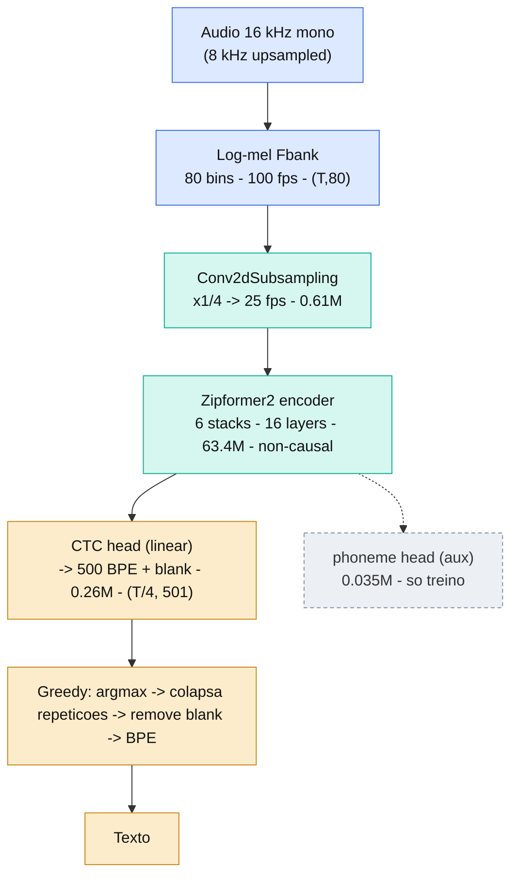
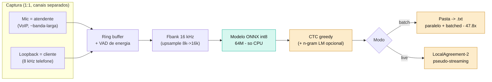
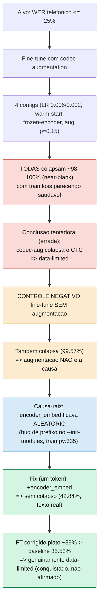
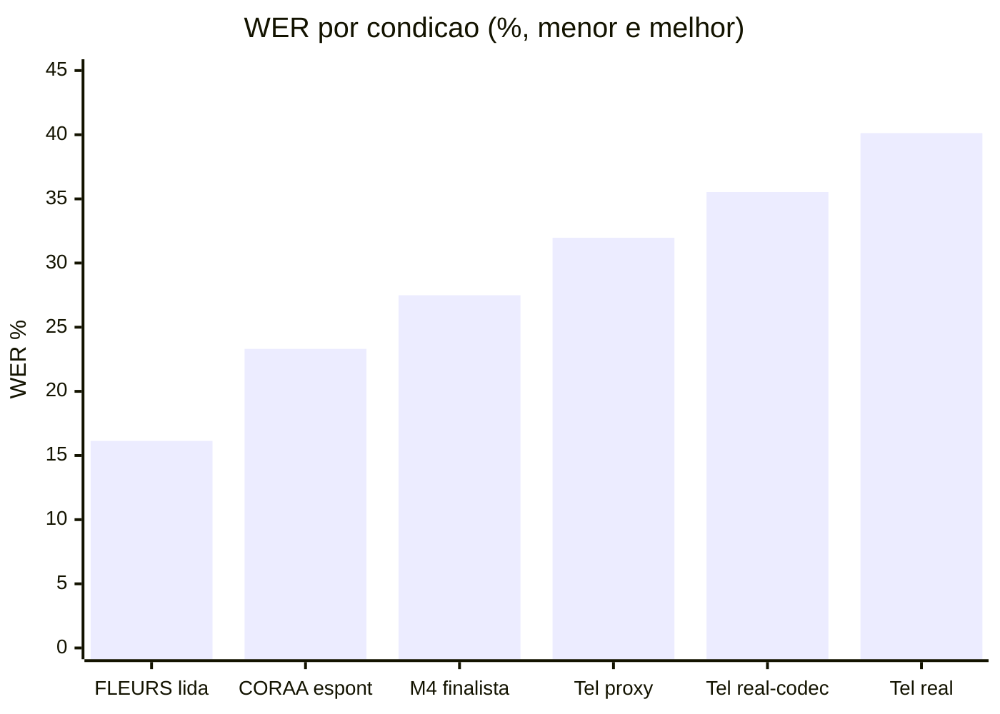
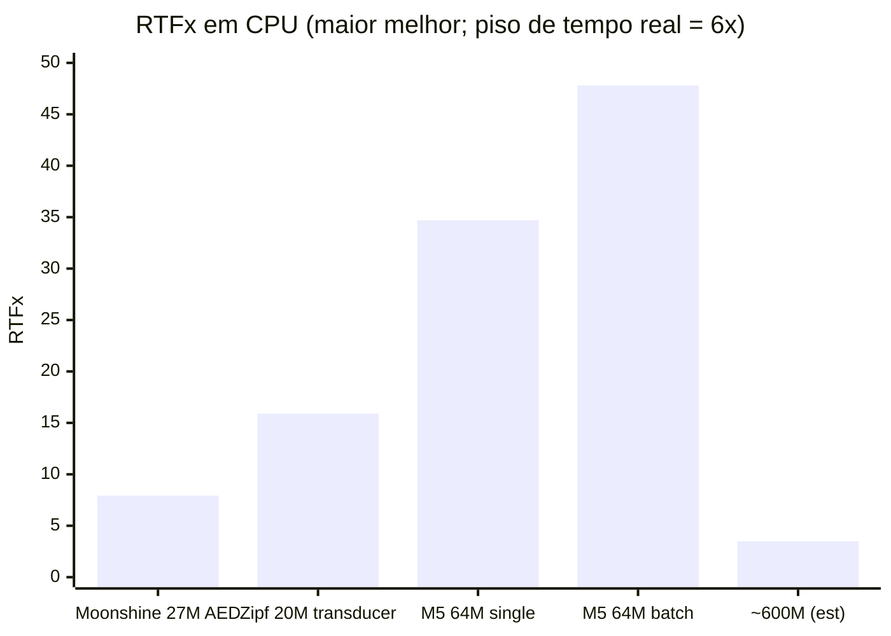
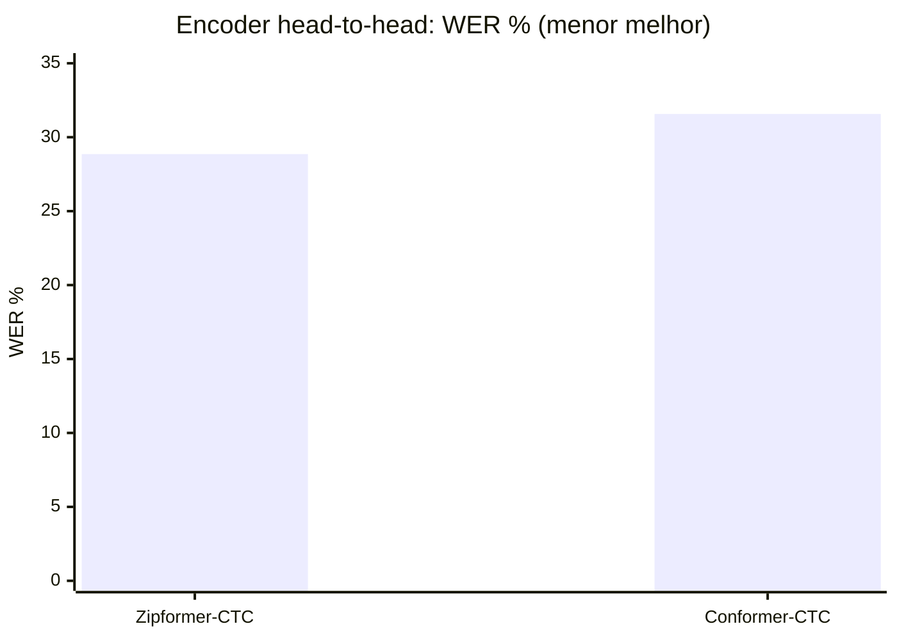

# Construindo um ASR especializado, em tempo real e só-CPU para Português Brasileiro: seleção de arquitetura por medição e um estudo de caso sobre um bug de configuração silencioso disfarçado de limite fundamental

**Macaw Voice — Relatório Técnico / Paper de Experiência (v1, PT-BR, 2026-07-30)**

> **Versão.** Este é o equivalente em português do paper `macaw-voice-cpu-asr.md`, com uma
> diferença deliberada: **cada componente é apresentado como "Problema → Como resolve"**, para que
> quem for construir o próprio modelo entenda não só *o quê*, mas *por que cada peça existe*.
>
> **Figuras.** Os diagramas usam Mermaid (renderizam no GitHub). Há uma versão HTML autocontida que
> renderiza em qualquer navegador em [`docs/paper/figuras.html`](./figuras.html); a arquitetura
> isolada em [`docs/paper/arquitetura.html`](./arquitetura.html).
>
> **Rótulos de proveniência** (`.claude/rules/asr-evidence-discipline.md`): `[MEDIDO]` (rodamos o
> experimento) · `[LITERATURA]` (terceiro citável) · `[FONTE-REPO]` (fato lido em código, arquivo:linha)
> · `[ESTIMATIVA]` (cálculo explícito) · `[DESCONHECIDO]`. Sem rótulo, o número não existe.

---

## Resumo

Relatamos o projeto ponta-a-ponta de um sistema de reconhecimento de fala (ASR) **em tempo real,
só-CPU**, para português brasileiro (PT-BR), pensado para rodar no próprio notebook do atendente
**sem GPU e sem chamada de rede**. Sob uma restrição dura de latência (fator de tempo real RTFx ≥ 6×
num notebook de referência de 15 W), mostramos que um **modelo pequeno e especializado** não é apenas
um meio-termo de custo, mas um **requisito**: um Zipformer-CTC de 64 M de parâmetros atinge 24–48× de
RTFx em CPU, enquanto um multilíngue de 600 M cairia abaixo do piso de tempo real. Descrevemos uma
**metodologia orientada a evidência** — todo número carrega rótulo de proveniência, hipóteses são
escritas antes da medição, e uma lista fixa de doze falácias invalidantes barra cada conclusão — e
mostramos como ela selecionou a arquitetura por **medição head-to-head**, não por reputação. O modelo
final atinge **16,14% de WER no FLEURS pt_br** (fala lida, banda-larga) e **23,31% de WER no CORAA**
(fala espontânea, banda-larga), medidos em CPU com inferência int8. A contribuição metodológica
central é um **estudo de caso de resultado negativo**: um alvo telefônico (≤ 25% WER em áudio de call
center 8 kHz) **não** foi atingido, e *quatro* experimentos sucessivos de fine-tune pareciam provar
que a augmentação de canal colapsa fundamentalmente um CTC convergido para saída quase-vazia. Um único
controle (fine-tune **sem augmentação alguma**) refutou essa conclusão e expôs a causa real: um **bug
de configuração de um token** — o front-end convolucional do modelo era silenciosamente deixado com
inicialização aleatória por um carregador `--init-modules` que casava prefixos. Depois da correção o
colapso sumiu, mas o WER estabilizou no mesmo ~36%, revelando que o gap residual é **limitado por
dados**, exatamente como o registro de riscos pré-declarado do projeto previa. Destilamos o pipeline
reproduzível e um checklist para praticantes, para que outros construam seu próprio ASR-CPU
especializado e evitem as armadilhas que enfrentamos.

**Palavras-chave:** reconhecimento de fala, Zipformer, CTC, inferência on-device, ASR em tempo real,
português de baixo-recurso, fala telefônica, reprodutibilidade, resultados negativos, falhas silenciosas.

---

## 1. Introdução

### 1.1 Motivação e tese

ASR em nuvem é acurado, mas carrega custo por hora, dependência de rede e preocupações de residência
de dados que são inaceitáveis para um call center que precisa transcrever *toda* ligação,
continuamente, num hardware que já possui. Nossa tese é a **especialização**: um modelo que faz *só*
fala telefônica PT-BR cabe em dezenas de milhões de parâmetros, onde um multilíngue de 600 M não fecha
tempo real num notebook. Este paper é o relato honesto e medido dessa tese — incluindo onde ela deu
certo, onde não deu, e *por quê*.

### 1.2 Escopo

O escopo é **o modelo acústico e seu motor de inferência**. Gestão de frota, compliance LGPD/GDPR e UI
estão fora. Todas as medições são em CPU (o alvo de deploy); nunca usamos benchmark de GPU para
justificar afirmação sobre CPU — disciplina que explicitamos no §3.

### 1.3 Contribuições

1. **Um protocolo de seleção de arquitetura por medição** (§4) que escolheu família de encoder,
   modelo e tamanho por experimento head-to-head sob a *condição de deploy* (carga concorrente de CPU,
   soak sustentado), não por micro-benchmark isolado nem reputação.
2. **Um framework de disciplina de evidência** (§3) — rótulos de proveniência, separação
   hipótese/evidência/conclusão e um checklist de falácias — que recomendamos para qualquer esforço de
   ML sob restrição de recurso.
3. **Um estudo de caso de resultado negativo** (§6) de valor pedagógico amplo: como um *bug silencioso
   de carga parcial de checkpoint* produziu uma narrativa de "limitação fundamental"
   completamente auto-consistente mas **falsa** ao longo de quatro experimentos, e como um único
   controle a expôs. Damos a assinatura exata da falha e o diagnóstico mínimo que generaliza.
4. **Artefatos reproduzíveis** (§10): inferência batch e streaming, um harness de benchmark público, e
   a ferramenta de augmentação/medição, todos com testes.

### 1.4 Uma nota sobre honestidade

Este relatório inclui um alvo que **não** atingimos e um bug que nós mesmos introduzimos. Mantemos os
dois, com destaque, porque o leitor aprende mais com a armadilha do que com o troféu, e porque um
relatório que esconde seus resultados negativos não é ciência.

---

## 2. Contexto e Trabalhos Relacionados

**Encoders.** Conformer [Gulati et al., 2020] e Zipformer [Yao et al., 2023, `arXiv:2310.11230`] são
os encoders dominantes com capacidade de streaming. O Zipformer introduz uma pilha multi-resolução
(down/up-sampling temporal entre blocos) e o otimizador ScaledAdam.

**Decoders.** Para inferência CPU de baixa latência, as famílias relevantes são **CTC** [Graves et al.,
2006], **RNN-T / transducer** e **attention encoder-decoder (AED)** (ex.: Whisper, Moonshine). AED é
autorregressivo e paga um custo por token que é punitivo em CPU.

**Comportamento peaky/blank do CTC.** O CTC tem tendência documentada a posteriores *peaky* que
concentram probabilidade no símbolo *blank* entre picos não-blank esparsos [Zeyer et al., *Why does CTC
result in peaky behavior?*, `arXiv:2105.14849`]. Esse atrator é central no §6.

**ASR telefônico/banda-estreita.** O canal telefônico de 8 kHz custa um fator conhecido de 2–3× em WER
versus banda-larga. Duas alavancas recorrem na literatura: **augmentação por simulação realista de
codec** [Vu et al., APSIPA 2019] e **treino com banda mista / casada ao canal** [Li et al., ICASSP 2013].

**Transformar modelos offline em streaming.** LocalAgreement-n [Macháček et al., ACL 2023 —
*whisper_streaming*] converte um modelo de sequência completa em simultâneo ao comprometer o prefixo
comum mais longo de decodificações sobrepostas consecutivas; reusamos isso no runtime de demo (§10).

Posicionamos este trabalho como um **paper de experiência/métodos**, não de nova arquitetura: a
contribuição é *como selecionar, treinar, medir e depurar* sob restrição de CPU em tempo real.

---

## 3. Restrições de Projeto e Protocolo de Avaliação

### 3.1 Restrições duras

| Restrição | Valor | Racional |
|---|---|---|
| RTFx (componente ASR isolado) | **≥ 6×** num i7-1355U de referência (15 W) | O pipeline completo (ASR + diarização + …) soma pelo *inverso* das taxas; ASR sozinho a 3× não deixaria orçamento. `[FONTE-REPO]` PRD §6 |
| Cauda de latência | p99, não média | a média esconde a cauda que quebra o produto `[FONTE-REPO]` PRD §6 |
| Carga sustentada | soak ≥ 10 min, softphone concorrente ativo | benchmark de 30 s mede turbo, não regime permanente, num chip de 15 W |
| Hardware | só CPU, sem GPU, sem rede | requisito de produto |

### 3.2 Disciplina de evidência (o método que mais recomendamos)

Todo número carrega **rótulo de proveniência**. Todo artefato de decisão separa **Hipótese** (escrita
*antes* da medição) da **Evidência** da **Conclusão**; uma conclusão que excede sua evidência é tratada
como defeito de severidade máxima *mesmo quando se prova certa depois*. As quatro falácias que mais
morderam aqui:

- **F1** — usar benchmark de GPU para justificar performance em CPU (regimes de memória/paralelismo diferentes).
- **F4** — benchmark curto (<10 min) num notebook de 15 W mede turbo, não clock sustentado.
- **F6** — tratar WER público de banda-larga como equivalente ao WER de call center 8 kHz.
- **F12** — concluir de um test set sem intervalo de confiança.

---

## 4. Método, Parte I — Seleção de Arquitetura por Medição

Não escolhemos arquitetura por reputação. Fixamos oito critérios de decisão *antes* de medir e deixamos
os experimentos head-to-head decidirem.

### 4.1 Família de decoder: CTC/transducer sobre AED (velocidade)

- **Problema que resolve:** em CPU, o gargalo não é o encoder — é o decoder. Um decoder autorregressivo
  (AED) recomputa a atenção a cada token gerado, e esse custo por token não some com quantização.
- **Como resolve:** o CTC decodifica em **uma passada** (uma projeção linear por frame + colapso
  greedy), sem laço autorregressivo. Medido `[MEDIDO]`: com tamanho parecido, transducer/CTC rodou
  **~2× mais rápido que AED** — Zipformer-20 M (transducer) = **15,90 ± 2,06× RTFx** vs
  Moonshine-tiny-27 M (AED) = **7,93 ± 0,72× RTFx** (n = 10, mesma clip, mesma CPU). Isso eliminou a
  família AED antes do piloto de acurácia.

### 4.2 Encoder: Zipformer sobre Conformer (acurácia, com params casados)

- **Problema que resolve:** com o mesmo orçamento de parâmetros (imposto pelo tempo real), qual encoder
  entrega menos erro? Escolher por "fama" arriscaria repetir a falha de método já registrada no projeto.
- **Como resolve:** medição head-to-head no mesmo corpus de 161 h, mesmo test FLEURS, mesmo decode
  `ctc-greedy-search`: **Zipformer domina Conformer em acurácia** — WER **28,86% vs 31,57%**, com o
  **IC 95% do delta [2,11, 3,31] excluindo zero** `[MEDIDO]`. Condições de decode casadas tornam a
  comparação limpa. A pilha multi-resolução do Zipformer (§4.5) extrai mais sinal por parâmetro.

### 4.3 Tamanho: decidido por soak + carga concorrente, não por velocidade isolada

- **Problema que resolve:** a intuição "modelo menor = mais rápido, escolha o menor" é uma armadilha
  (falácia F8: velocidade não é linear em parâmetros). Medir 30 s isolado mediria o turbo e mentiria.
- **Como resolve:** **isolado**, o `small` é só ~1,15× mais rápido que o `medium` — não os ~2× que a
  contagem de parâmetros sugere. Sob a **condição de deploy** (carga concorrente, soak sustentado no
  i7-1355U), `small` e `medium` **empatam** em RTFx (mín 7,1× vs 7,6×, ambos ≥ 6×) `[MEDIDO]`.
  Satisfeito o critério de tempo real por ambos, o desempate migra para acurácia → **`medium` (64 M)
  vence por −1,11 pp de WER**. Tivéssemos medido isolado por 30 s, teríamos preferido o `small` errado.

### 4.4 Cabeça de fonema auxiliar (uma alavanca de acurácia grátis na inferência)

- **Problema que resolve:** o modelo aprende a mapear áudio→BPE, mas o BPE é uma unidade ortográfica —
  não carrega diretamente a pista fonética que distingue pares mínimos do PT-BR. Dá para injetar sinal
  fonético no treino sem pagar custo na inferência?
- **Como resolve:** adicionamos uma **segunda cabeça CTC de fonema** no encoder compartilhado durante o
  treino (peso de loss 0,3). Ela força o encoder a organizar representações foneticamente melhores.
  Ganho medido no `medium`: **28,86% → 27,49%** (−4,74% relativo, IC 95% [2,79, 6,72],
  P(≥3% rel) = 95,7%) `[MEDIDO]`. A cabeça é **removida no export** — **zero custo de inferência**.

**Finalista:** Zipformer-CTC `medium` 64 M + cabeça de fonema auxiliar, ONNX int8 (~70 MB),
deliverable **27,49%** de WER em fala lida/quase-lida banda-larga `[MEDIDO]`.

### 4.5 A arquitetura, componente por componente

`áudio 16 kHz → log-mel fbank (80 bins, 100 fps) → Conv2dSubsampling (÷4 → 25 fps, 0,61 M) →
encoder Zipformer2 (6 stacks, 16 layers, 63,4 M, não-causal) → cabeça CTC linear (→ 500 BPE + blank,
0,26 M) → colapso greedy → texto`. A cabeça de fonema (0,035 M) existe só no treino.

**Figura 1 — Arquitetura do modelo (fluxo de sinal).** Verde = codificação (pesada, 64 M); âmbar =
decodificação (leve, greedy); tracejado = só treino, removido no export.



Cada componente, no formato **Problema → Como resolve**:

| # | Componente | Problema que resolve | Como resolve |
|---|---|---|---|
| 1 | **Upsample 8→16 kHz** | O modelo tem *um* formato de entrada (16 kHz). Telefonia chega a 8 kHz. Manter dois caminhos dobraria a complexidade. | Reamostra 8→16 kHz na entrada. Não *cria* informação acima de 4 kHz, mas dá um formato único; o custo é desprezível (§4.5 nota) porque o modelo é pequeno. |
| 2 | **Log-mel Fbank (80 bins, 100 fps)** | A forma de onda crua tem 16 000 amostras/s — denso, redundante e mal-condicionado para a rede. | DSP pura (sem rede) comprime cada 10 ms num vetor de 80 energias em escala mel, que aproxima a percepção humana de frequência. Reduz a dimensão e realça o que importa para fala. |
| 3 | **Conv2dSubsampling (÷4 → 25 fps)** | 100 frames/s é caro para a atenção (custo quadrático no tempo) e fino demais — fonemas duram ~80 ms. | Duas convoluções com stride comprimem o tempo em 4× (100→25 fps) e projetam para a dimensão do encoder. Menos frames = atenção mais barata = mais RTFx. **É o componente do bug do §6.** |
| 4 | **Encoder Zipformer2 (6 stacks multi-resolução)** | Extrair o máximo de sinal acústico por parâmetro, sob teto de 64 M (tempo real). Um Transformer plano gasta capacidade processando tudo na mesma resolução. | Seis pilhas rodam em resoluções e larguras diferentes (mais profundo no meio: dim 512, ds 8×). Downsampling entre blocos foca capacidade onde importa. Cada layer = self-attention + módulo convolucional (kernel 15–31) + 2 feed-forwards. |
| 5 | **Cabeça CTC (linear → 501)** | Converter as representações do encoder em probabilidades por unidade, **sem exigir alinhamento** áudio↔texto rotulado (que não temos). | Uma projeção linear por frame para 500 sub-palavras BPE + 1 blank. A loss CTC soma sobre todos os alinhamentos possíveis — aprende o alinhamento sozinho. É a saída do ONNX (log_probs). |
| 6 | **Cabeça de fonema auxiliar** | BPE ortográfico não carrega diretamente a distinção fonética; queríamos mais acurácia sem custo de inferência. | Segunda cabeça CTC (alvo fonético) no treino, peso 0,3. Regulariza o encoder → −4,74% rel de WER. **Removida no export** (custo zero). |
| 7 | **Decode greedy CTC** | Transformar (T/4, 501) probabilidades em texto, rápido o bastante para caber no orçamento de CPU. | `argmax` por frame → colapsa repetições → remove blank → destokeniza BPE. Uma passada, sem laço. (Beam+LM é opcional para ganhar ~10–15% rel — §5.3.) |

As seis pilhas do Zipformer (mais profundo no meio):

| Pilha | S1 | S2 | S3 | **S4** | S5 | S6 |
|---|---|---|---|---|---|---|
| dim | 192 | 256 | 384 | **512** | 384 | 256 |
| layers | 2 | 2 | 3 | **4** | 3 | 2 |
| downsample | 1 | 2 | 4 | **8** | 4 | 2 |
| heads de atenção | 4 | 4 | 4 | **8** | 4 | 4 |

### 4.6 System design (o sistema de deployment)

O modelo é um componente de um sistema que roda inteiro na CPU do atendente, sem GPU e sem rede.

**Figura 2 — System design (captura por-stream → inferência CPU → texto).**



Cada componente do sistema, no formato **Problema → Como resolve**:

| Componente | Problema que resolve | Como resolve |
|---|---|---|
| **Captura por-stream (mic/loopback)** | Saber *quem* falou (atendente vs cliente) normalmente exige um modelo de diarização — caro e imperfeito. | No caso 1:1 dominante, o mic *é* o atendente e o loopback *é* o cliente **por construção**. Roteamento determinístico: custo zero, 100% de acurácia, diarização desnecessária. |
| **Ring buffer + VAD de energia** | Áudio chega em fluxo contínuo; rodar o modelo em silêncio desperdiça CPU e insere lixo. | Um buffer circular acumula áudio; um VAD por energia (RMS + histerese) marca fala vs silêncio e corta segmentos nos silêncios — o modelo só roda no que importa. |
| **Inferência ONNX int8** | Um modelo fp32 é ~4× maior e mais lento; sem GPU, cada ciclo conta. | Quantização para int8 (pesos de 8 bits) via ONNX Runtime — ~70 MB, aproveita AVX-VNNI na CPU. WER praticamente idêntico ao fp32, RTFx muito acima do piso. |
| **Modo batch (paralelo)** | Transcrever pastas de gravações offline o mais rápido possível, sem desperdiçar núcleos. | Decodifica áudio via ffmpeg (qualquer formato), segmenta por VAD, **empilha** segmentos num batch ONNX e decodifica em paralelo (ThreadPool). Medido: **47,8×** RTFx. |
| **Modo streaming (LocalAgreement-2)** | O encoder é não-causal (vê o áudio todo); ao vivo, precisamos emitir palavras antes do fim. | Roda decodificações sobrepostas e compromete o prefixo comum mais longo entre duas consecutivas — converte o modelo offline em pseudo-streaming para a demo. |
| **n-gram LM shallow fusion (opcional)** | O decode greedy não conhece o idioma além do que o acústico viu; erra em palavras raras. | Um LM de n-gramas soma sua pontuação no beam search (shallow fusion), ganhando ~10–15% relativo `[LITERATURA]` sem tocar no modelo nem nos dados. |

---

## 5. Método, Parte II — Dados e Treino em Escala

### 5.1 O corpus é o risco dominante

Tínhamos ~9 k h de áudio PT-BR contra as 15 k–94 k h que receitas de modelos pequenos *do zero*
tipicamente consomem — e treino do zero é justamente o regime mais faminto por dados. O projeto
registrou isso de antemão como **M5 Top-Risk #2**: *"corpus insuficiente faz o WER estabilizar acima do
alvo, e nenhuma otimização de runtime compensa."* Essa pré-declaração importa no §6.

### 5.2 Comportamento de fine-tune: overfitting prova que a capacidade é suficiente

- **Problema que resolve entender isso:** decidir se o gap de WER vem de *modelo pequeno demais*
  (subcapacidade → trocar arquitetura) ou de *dado insuficiente* (→ investir em dado). Trocar
  arquitetura seria retrabalho contra a medição de M4.
- **Como o diagnóstico responde:** o fine-tune num mux de CORAA (humano) + TAGARELA (pseudo-rotulado
  por Whisper) faz **overfitting** — dentro de cada época a val loss sobe acima da train (≈0,23 →
  0,29–0,34) e o WER degrada, recuperando na fronteira de época `[MEDIDO]`. **Overfitting prova que o
  encoder tem capacidade *sobrando*** — um modelo pequeno demais faria o oposto (underfitting). Logo, a
  alavanca é **qualidade de dado**, não arquitetura maior (que também quebraria o tempo real). O
  deliverable de M5 atingiu **23,31% WER banda-larga / 34,69× RTFx CPU** `[MEDIDO]`.

### 5.3 Três alavancas "grátis" de regularização antes de coletar dado caro

Recomendamos esgotar, nesta ordem — cada uma no formato Problema → Como resolve:

1. **Augmentação como regularização.** *Problema:* o modelo decora o ruído dos pseudo-rótulos.
   *Como resolve:* ligar a cadeia Reverb→Ruído→Telefone força invariância a canal → menos overfitting,
   de graça; bônus, ataca o DoD telefônico.
2. **Checkpoint averaging.** *Problema:* a oscilação intra-época faz o melhor single-checkpoint ser
   instável. *Como resolve:* media os pesos de checkpoints pós-shuffle (`average_checkpoints` do
   icefall) — suaviza a oscilação. Mediu: **25,81% → 23,31%** full-test int8 `[MEDIDO]`.
3. **Beam search + n-gram LM.** *Problema:* greedy é o piso de acurácia. *Como resolve:* shallow fusion
   com LM (~10–15% relativo em conjuntos difíceis `[LITERATURA]`). Só depois disso se investe em dado novo.

---

## 6. Estudo de Caso — Um Bug de Configuração Silencioso Disfarçado de Limite Fundamental

Esta é a lição central do paper: um conto de advertência sobre **conclusões erradas auto-consistentes**,
e a disciplina que recupera.

### 6.1 O alvo e a primeira medição honesta

O Definition-of-Done telefônico era **≤ 25% WER em áudio de call center 8 kHz**. Medimos primeiro o
modelo banda-larga *entregue* numa clip **real** de call center (transcrita por humano): **40,13% WER**
`[MEDIDO]` — *pior* que um proxy bandpass simples sugeria (31,97%), um caso de manual da falácia F6 (o
proxy subestimou o canal real). Um baseline honesto real-codec mono-falante pôs o teto em **~35,53%**.

### 6.2 A armadilha: quatro experimentos que "provaram" a coisa errada

Para adaptar ao canal, fizemos fine-tune com augmentação telefônica on-the-fly. Colapsou. Variamos, ao
longo de **quatro** experimentos, a taxa de aprendizado (0,006 → 0,002), o checkpoint de warm-start
(médio → single), o conjunto de parâmetros treináveis (modelo cheio → corpo-do-encoder congelado) e a
intensidade da augmentação (p = 0,5 com musan → p = 0,15 sem musan). **Toda configuração colapsou o
decode greedy para quase-blank** (WER 97,8–100%, quase-zero tokens corretos) enquanto a loss CTC de
*treino* parecia saudável `[MEDIDO]`. A literatura tornava a narrativa sedutora: o atrator de blank do
CTC (`arXiv:2105.14849`) somado a augmentação agressiva é uma instabilidade conhecida. Depois de quatro
falhas consistentes, escrevemos — e quase publicamos — a conclusão de que **fine-tune com augmentação
de canal de um CTC convergido é fundamentalmente propenso a colapso, e ≤25% é limitado por dados.**

Essa conclusão estava **errada na sua alegação causal**, e perigosamente auto-consistente.

### 6.3 O controle que quebrou a narrativa

- **Problema que o controle resolve:** N falhas que compartilham a *mesma* suposição não-testada não
  provam nada sobre a suposição. Todas as quatro tinham augmentação — e se a augmentação for inocente?
- **Como resolve:** rodamos o **controle negativo** — fine-tune com **augmentação nenhuma**. Se a
  augmentação fosse a causa, esse run deveria ficar em ~36%. Ele **também colapsou** (99,57% WER, 16
  palavras corretas de 3728) `[MEDIDO]`. Logo a augmentação **não** era a causa — a falha estava no
  **setup de fine-tune em si**, independente de augmentação.

### 6.4 A causa-raiz: um carregador por-prefixo aleatorizando o front-end em silêncio

Lendo o carregador (`train.py:335` `[FONTE-REPO]`):

```python
src_keys = [k for k in src_state_dict if k.startswith(module.strip() + ".")]
```

`--init-modules "encoder,ctc_output,phoneme_output"` carrega parâmetros cujos nomes começam com cada
prefixo **mais um ponto**. O prefixo `"encoder."` casa o corpo de 63 M (`encoder.*`) mas **não** o
front-end convolucional de 0,61 M `encoder_embed.*` (que começa com `"encoder_"`, não `"encoder."`). O
front-end ficava, portanto, em **inicialização aleatória a cada run de fine-tune**. Um front-end
aleatório injeta ruído num encoder que era bom; sob CTC, a resposta que minimiza a loss para ruído é
*blank* — daí o colapso, com ou sem augmentação, em qualquer taxa de aprendizado. O run original
bem-sucedido treinou o front-end do zero por 10 épocas com LR alto, e por isso *ele* não colapsou;
nossos fine-tunes curtos e de LR baixo nunca re-aprenderiam um front-end aleatório a tempo.

**O fix é um token:** adicionar `encoder_embed` a `--init-modules`. Confirmado no log (`Loading
parameters with prefix encoder_embed`), o colapso sumiu imediatamente: o run corrigido produziu texto
real (não mais blank): 42,84% → 40,50% → 39,97% → 39,38% de WER ao longo dos checkpoints `[MEDIDO]`.

### 6.5 A resolução honesta: método corrigido, teto limitado por dados

Com o bug corrigido, o fine-tune corrigido **não colapsou** — mas seu WER **estabilizou em ~39%, acima
do baseline sem-fine-tune de 35,53%**, caindo ~0,5 pp a cada 4000 passos `[MEDIDO]`. Fine-tune no
*mesmo* mux adiciona robustez a canal mas **nenhuma informação nova**, e faz overfitting. O gap
residual até ≤25% é, portanto, genuinamente **limitado por dados** — a mesma conclusão a que havíamos
chegado prematuramente no §6.2, mas agora *conquistada* com o método correto, não *afirmada* sobre um
bug. Esta é a diferença epistêmica crucial: o número era parecido; a **alegação causal era
completamente diferente**, e só o controle podia distingui-los.

**Figura 3 — A árvore de decisão do debug (§6).** Quatro falhas auto-consistentes *não* provaram o
mecanismo; o único controle negativo sim.



### 6.6 A lição generalizável

- **Cargas parciais de checkpoint falham em silêncio.** Um carregador `strict=False` / por-prefixo
  deixará um módulo aleatório e não reportará nada. Sempre **asserte** que o conjunto de chaves
  carregadas é igual ao esperado, e **logue as normas dos parâmetros** de cada módulo após a carga.
- **Uma loss de treino saudável não certifica o modelo.** Sob CTC, a train loss pode ser moderada
  enquanto o decode greedy é degenerado. Gate numa **métrica decodificada**, não na loss.
- **Rode o controle negativo antes de publicar um mecanismo.** N falhas auto-consistentes que
  compartilham uma suposição não-testada não provam nada sobre ela. Remover a *suposta* causa é o
  desambiguador mais barato; aqui custou ~30 min e derrubou uma conclusão de quatro experimentos.
- **Riscos pré-declarados valem seu peso.** O resultado limitado-por-dados casou com o M5 Top-Risk #2
  literalmente; o registro nos manteve honestos sobre *qual* explicação confiar depois de remover o bug.

---

## 7. Resultados

Todos os números `[MEDIDO]` em CPU, ONNX int8, greedy CTC, via os harnesses liberados (§10).

| Condição | Dataset | WER | Notas |
|---|---|---|---|
| Lida, banda-larga | FLEURS pt_br (100 utt, 2552 palavras) | **16,14%** | 87,9% acertos; o teto "banda-larga limpa" |
| Espontânea, banda-larga | CORAA test (completo) | **23,31%** | deliverable de M5 |
| Lida/quase-lida (finalista) | FLEURS | 27,49% | finalista de M4, medium+fonema |
| Telefônico proxy (bandpass) | CORAA + bandpass | ~31,97% | otimista (F6) |
| Telefônico real-codec | CORAA + codec pool | ~35,53% | baseline honesto mono-falante |
| Telefônico real | clip de call center | ~40,13% | 2 falantes mono-misturados, IC largo |

**Figura 5 — WER por condição (%, menor é melhor).** A penalidade ~2× banda-larga→telefônico é visível.



**DoD telefônico (≤25%): não atingido.** O modelo entregue no telefônico real fica em ~36%; o gap é
limitado por dados (§6). Reportamos como achado, não como nota de rodapé.

---

## 8. Eficiência

`[MEDIDO]`, só CPU (sem GPU), ONNX int8:

- **RTFx single-stream:** 34,69× (deliverable de M5) — 5,8× acima do piso ≥6×.
- **Batch offline** (transcrição de pasta, decode paralelo + inferência batched): **47,8×** numa
  ligação real de 9,2 min em 11,5 s; **24,6×** em 100 utterances curtas do FLEURS (mais overhead por
  arquivo). ~1 h de áudio transcreve em ~75–150 s num notebook.
- **Modelo:** ~64 M params, ONNX int8 ~70 MB, taxa de features 25 fps.
- **Por que modelos grandes não cabem** `[ESTIMATIVA]`: um modelo de ~600 M (~9× nossos parâmetros)
  escala para grosseiramente ~3–4× RTFx na mesma CPU — **abaixo do piso de 6×**. Tamanho→velocidade não
  é linear (F8), mas a ordem de grandeza se mantém e é a base empírica da tese de especialização.

**Figura 6 — RTFx em CPU (maior é melhor; o piso de tempo real ≥6×).** A tese de especialização num
gráfico: nosso 64 M fica muito acima do piso; um ~600 M cairia abaixo.



**Figura 7 — Seleção de arquitetura: Zipformer vs Conformer (WER %, params casados, mesmo decode).**
Delta 2,71 pp, IC 95% [2,11, 3,31] exclui zero.



---

## 9. Lições para Praticantes — Construa o Seu

Checklist destilado para quem for construir um ASR-CPU especializado em tempo real:

1. **Meça sob a condição de deploy, não isolado.** Soak ≥ 10 min com carga concorrente realista na CPU
   *alvo*. Reporte p99, média ± desvio e um intervalo de confiança.
2. **Escolha o tamanho pelo *empate* de tempo real, depois desempate por acurácia.** Se dois tamanhos
   passam do piso de latência sob carga, fique com o mais acurado (§4.3).
3. **Prefira CTC/transducer a AED em CPU** (sem custo autorregressivo por token; ~2× aqui).
4. **Use uma cabeça de fonema auxiliar** como alavanca de acurácia grátis na inferência.
5. **Esgote as alavancas grátis antes de coletar dado:** augmentação-como-regularização → checkpoint
   averaging → beam + n-gram LM.
6. **Faça fine-tune defensivamente:** LR baixo (~1/10 do pré-treino), warmup longo, warm-start single
   (não médio), `--use-mux` / preserve dado limpo — e, a armadilha que caímos, **verifique que cada
   módulo carregou de fato** (asserte conjuntos de chaves; logue normas).
7. **Gate numa métrica decodificada, não na loss.** Decodifique um subset held-out a cada checkpoint.
8. **Rode o controle negativo antes de acreditar num mecanismo.**
9. **Rotule a proveniência de todo número e separe hipótese de conclusão.** É o seguro mais barato
   contra uma história errada auto-consistente.
10. **Para telefônico 8 kHz, orce dado *real* de canal.** Augmentação de codec simulada ajuda mas
    satura; a alavanca confiável é áudio telefônico real transcrito por humano.

---

## 10. Reprodutibilidade

Artefatos liberados e testados (159 testes unitários no total):

- **`training/batch/batch_transcribe.py`** — pasta → transcrições, decode via ffmpeg (qualquer formato),
  segmentação por VAD de energia, inferência ONNX batched, decode paralelo; 7 testes incl. um smoke ponta-a-ponta.
- **`training/batch/eval_public_hf.py`** — benchmark público reproduzível (FLEURS pt_br) com WER + RTFx.
- **`training/eval/measure_realcodec.py`, `training/eval/measure_callcenter.py`** — harnesses honestos de WER telefônico.
- **`scripts/corpus/codec_pool.py`** — augmentação realista por pool de codecs (G.711 via audioop;
  GSM/Opus via ffmpeg / torchaudio `AudioEffector` in-process para throughput).
- **`models/…/mic_transcribe.py`** — demo de mic em tempo real (LocalAgreement-2 pseudo-streaming sobre
  o modelo não-causal).
- Runbooks (`run_ft_*.sh`) capturam as configurações exatas de treino, incluindo o `--init-modules` corrigido.

A decisão do finalista, as ablações e a investigação telefônica estão registradas com comandos e
números por-run em `training/results/` e nos blueprints de descoberta, sob uma trilha de ADRs (`0001`–`0003`).

---

## 11. Limitações e Ameaças à Validade

- **O WER telefônico ainda não está no alvo** e as medições telefônicas reais têm **intervalos de
  confiança largos** (uma clip de 9 min; F12). Deliberadamente não super-afirmamos a partir delas.
- **Hardware de referência ≠ piso da frota.** Todo timing assume um i7-1355U; a frota BYOD real é
  desconhecida e provavelmente pior. Extrapolar do notebook de referência para "a frota" é a falácia
  remanescente mais provável.
- **Ruído de pseudo-rótulo (TAGARELA).** Parte do mux de treino é pseudo-rotulada por Whisper; seu
  ruído é fonte do overfitting no §5.2.
- **Encoder não-causal.** Os resultados são batch/offline; streaming palavra-a-palavra de baixa
  latência (um encoder causal) é trabalho futuro.

---

## 12. Conclusão

Um ASR PT-BR pequeno, especializado e só-CPU é factível e *rápido* (16,14% WER em banda-larga lida,
24–48× RTFx num notebook) — mas só se o tamanho for escolhido por medição sob a condição de deploy, e
só se o pipeline for depurado contra uma métrica **decodificada** com os controles negativos de fato
rodados. Nosso resultado mais transferível não é o modelo, mas uma advertência: um **bug de
configuração silencioso de um token** fabricou uma "limitação fundamental" completamente
auto-consistente, apoiada na literatura, ao longo de quatro experimentos — que era simplesmente falsa.
A disciplina que a pegou — rótulos de proveniência, um gate decodificado e, decisivamente, o único
controle que faltava — é mais barata que as semanas que teria economizado. O gap telefônico residual é
honestamente limitado por dados, casando com um risco pré-declarado; fechá-lo é questão de dado
telefônico real, não de uma loss mais esperta.

---

## Referências

- Graves, Fernández, Gomez, Schmidhuber (2006). *Connectionist Temporal Classification.* ICML.
- Gulati et al. (2020). *Conformer: Convolution-augmented Transformer for Speech Recognition.* Interspeech.
- Yao et al. (2023). *Zipformer: A faster and better encoder for ASR.* `arXiv:2310.11230`.
- Zeyer, Bahar, Schlüter, Ney (2021). *Why does CTC result in peaky behavior?* `arXiv:2105.14849`.
- Vu, Zeng, Xu, Chng (2019). *Audio Codec Simulation based Data Augmentation for Telephony Speech Recognition.* APSIPA.
- Li, Yu, Huang, Gong (2013). *Improving Wideband Speech Recognition Using Mixed-Bandwidth Training Data.* ICASSP.
- Macháček, Dabre, Bojar (2023). *Turning Whisper into Real-Time Transcription System.* ACL demo (whisper_streaming).
- Internas: ADRs `0001`–`0003`; registros de resultado em `training/results/`; blueprints de descoberta
  em `knowledge-base/discoveries/blueprints/`; regra de disciplina de evidência
  `.claude/rules/asr-evidence-discipline.md`.

---

*Proveniência: todo número quantitativo neste paper é rotulado `[MEDIDO] / [LITERATURA] / [FONTE-REPO]
/ [ESTIMATIVA] / [DESCONHECIDO]`. Os números medidos foram produzidos num notebook Intel i7 de 12
núcleos com ONNX Runtime int8, greedy CTC, via os harnesses do §10, e são rastreáveis aos registros de
resultado citados no §10. Esta versão PT-BR é fiel ao `macaw-voice-cpu-asr.md`; divergências de número
entre as duas versões são bug e devem ser reportadas.*
