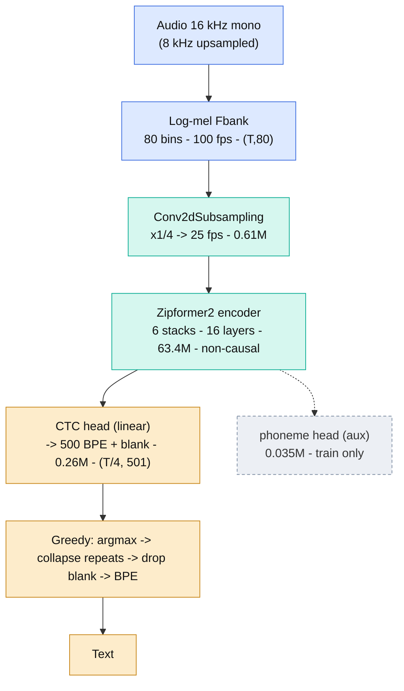
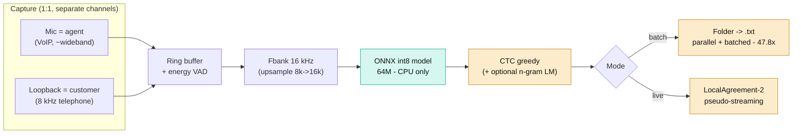
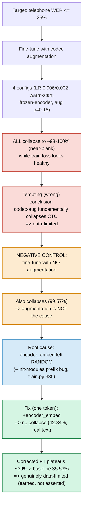
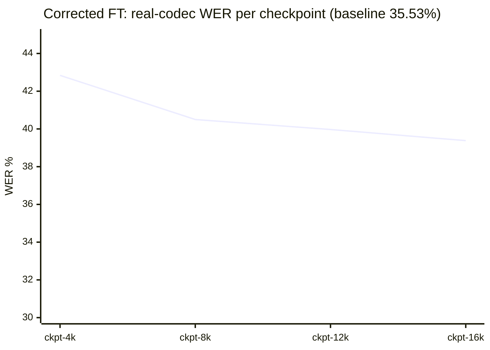
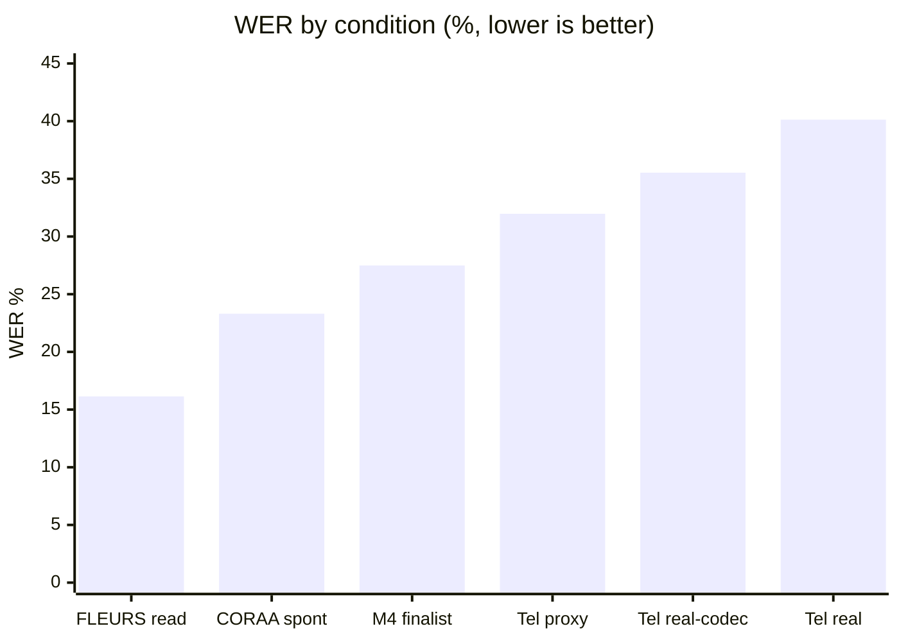
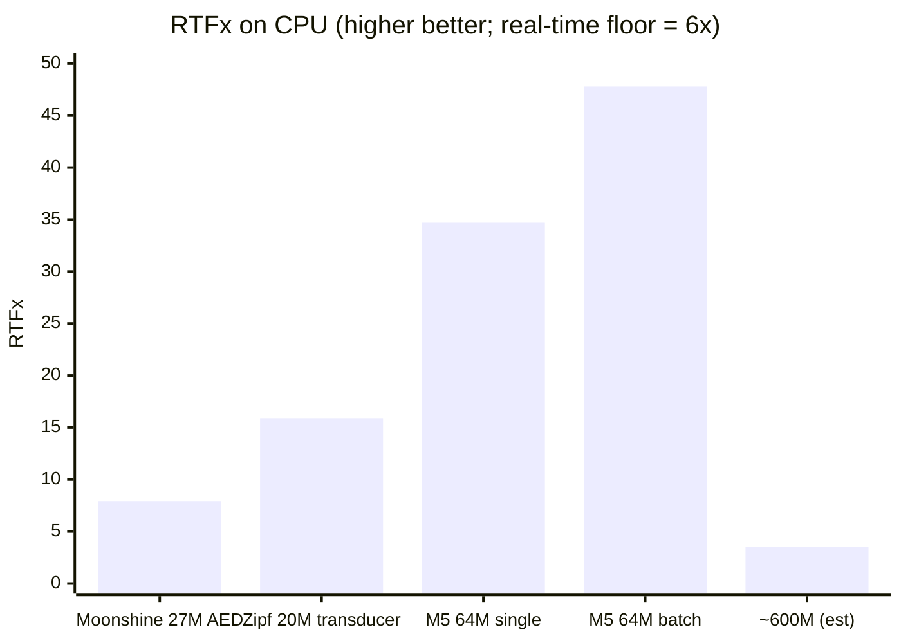
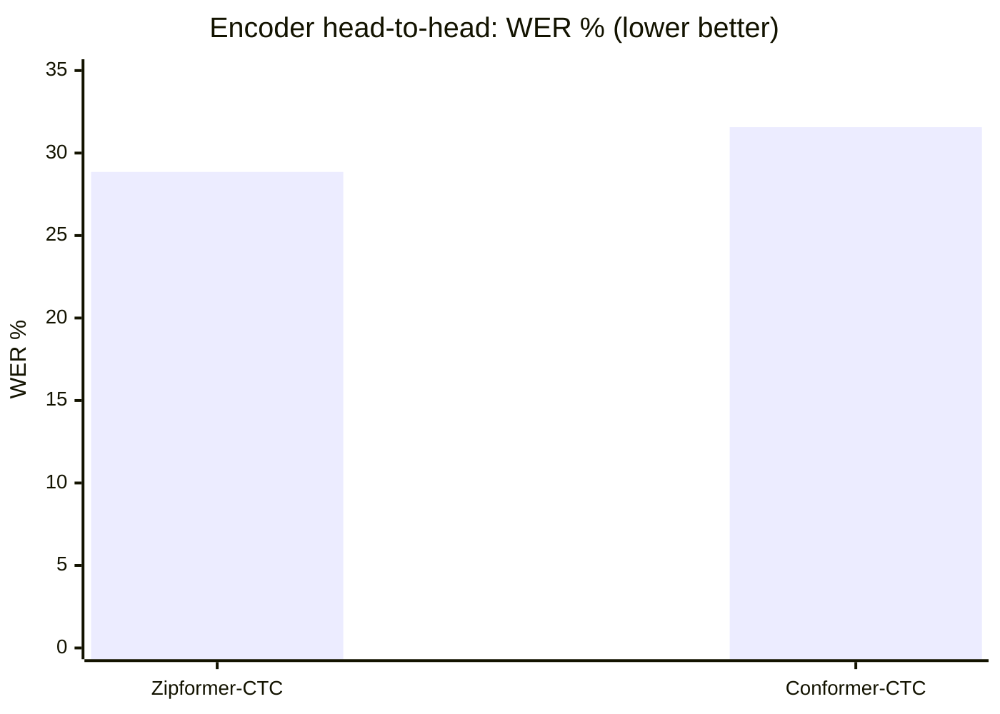

# Building a Real-Time, CPU-Only Specialized ASR for Brazilian Portuguese: Measured Architecture Selection and a Cautionary Case Study on a Silent Configuration Bug Masquerading as a Fundamental Limit

**Macaw Voice — Technical Report / Experience Paper (v1, 2026-07-30)**

> **Language.** Portuguese (PT-BR) edition — with each component framed as *"problem it solves → how"* —
> at [`docs/paper/macaw-voice-cpu-asr.pt-br.md`](./macaw-voice-cpu-asr.pt-br.md).
>
> **Figures.** Diagrams below use Mermaid (rendered on GitHub and Mermaid-capable viewers). A
> **self-contained, always-rendered HTML companion** with all figures is at
> [`docs/paper/figuras.html`](./figuras.html) (open in a browser); the model architecture alone is at
> [`docs/paper/arquitetura.html`](./arquitetura.html).

---

## Abstract

We report the end-to-end design of a **real-time, CPU-only** automatic speech recognition (ASR)
system for Brazilian Portuguese (PT-BR), intended to run on the agent's own laptop with **no GPU
and no network call**. Under a hard latency constraint (real-time factor RTFx ≥ 6× on a reference
15 W laptop CPU), we show that a **small, specialized model** is not merely a cost compromise but a
requirement: a 64 M-parameter Zipformer-CTC reaches 24–48× RTFx on CPU, whereas a 600 M multilingual
model would fall below the real-time floor. We describe an **evidence-first methodology** — every
number carries a provenance label, hypotheses are written before measurement, and a fixed list of
twelve invalidating fallacies gates every conclusion — and show how it selected the architecture by
head-to-head measurement rather than by reputation. Our final model attains **16.14 % WER on FLEURS
pt_br** (read, wideband) and **23.31 % WER on CORAA** (spontaneous, wideband), measured on CPU with
int8 inference. The central methodological contribution is a **negative-result case study**: a
telephone-domain target (≤ 25 % WER on 8 kHz call-center audio) was **not** met, and *four* successive
fine-tuning experiments appeared to prove that channel-augmentation fine-tuning fundamentally
collapses a converged CTC model to near-blank output. A single controlled ablation (fine-tuning with
**no augmentation at all**) refuted that conclusion and exposed the true cause: a **one-token
configuration bug** — the model's convolutional front-end was silently left randomly initialized by a
prefix-matching `--init-modules` loader. After the fix the collapse vanished, but the WER plateaued at
the same ~36 %, revealing that the residual gap is **data-limited**, exactly as the project's own
pre-registered risk register had predicted. We distill the reproducible pipeline and a practitioner
checklist so that others can build and train their own specialized CPU ASR and avoid the traps we hit.

**Keywords:** speech recognition, Zipformer, CTC, on-device inference, real-time ASR, low-resource
Portuguese, telephone speech, reproducibility, negative results, silent failure modes.

---

## 1. Introduction

### 1.1 Motivation and thesis

Cloud ASR is accurate but carries per-hour cost, network dependence, and data-residency concerns that
are unacceptable for a call center that must transcribe every call, continuously, on hardware it
already owns. Our thesis is **specialization**: a model that does *only* PT-BR telephone speech can
fit in tens of millions of parameters, where a multilingual 600 M model cannot close real-time on a
laptop CPU. This paper is the honest, measured account of pursuing that thesis — including where it
succeeded, where it did not, and *why*.

### 1.2 Scope

The scope is **the acoustic model and its inference engine**. Fleet management, LGPD/GDPR compliance,
and UI are out of scope. All measurements are on CPU (the deployment target); we never use a GPU
benchmark to justify a CPU claim — a discipline we make explicit in §3.

### 1.3 Contributions

1. **A measured architecture-selection protocol** (§4) that chose encoder family, model, and size by
   head-to-head experiment under the *deployment* condition (concurrent CPU load, sustained soak), not
   by isolated micro-benchmarks or reputation.
2. **An evidence-discipline framework** (§3) — provenance labels, hypothesis/evidence/conclusion
   separation, and a fallacy checklist — that we recommend for any resource-constrained ML effort.
3. **A negative-result case study** (§6) with, we believe, broad pedagogical value: how a *silent
   partial-checkpoint-load bug* produced a fully self-consistent but **false** "fundamental limitation"
   narrative across four experiments, and how one controlled ablation exposed it. We give the exact
   failure signature and the minimal diagnostic that generalizes.
4. **Reproducible artifacts** (§10): batch and streaming inference, a public-benchmark harness, and
   the augmentation/measurement tooling, all with tests.

### 1.4 A note on honesty

This report includes a target we did **not** reach and a bug we introduced ourselves. We keep both,
prominently, because the reader learns more from the trap than from the trophy, and because a report
that hides its negative results is not science. Every quantitative claim is labeled:
`[MEASURED]` (we ran it — command, hardware, repetitions),
`[LIT]` (reported by a cited third party),
`[REPO]` (a fact read from cloned reference source, file:line),
`[EST]` (derived by an explicit calculation), or
`[UNKNOWN]`.

---

## 2. Background and Related Work

**Encoders.** Conformer [Gulati et al., 2020] and Zipformer [Yao et al., 2023, `arXiv:2310.11230`]
are the dominant streaming-capable encoders. Zipformer introduces a multi-resolution stack (temporal
down/up-sampling between blocks) and the ScaledAdam optimizer.

**Decoders.** For low-latency CPU inference the relevant families are **CTC** [Graves et al., 2006],
**RNN-T / transducer**, and **attention encoder-decoder (AED)** (e.g. Whisper, Moonshine). AED is
autoregressive and pays a per-token decode cost that is punishing on CPU.

**Peaky/blank behavior of CTC.** CTC has a well-documented tendency toward *peaky* posteriors that
concentrate probability on the blank symbol between sparse non-blank spikes [Zeyer et al.,
*Why does CTC result in peaky behavior?*, `arXiv:2105.14849`]. This attractor is central to §6.

**Telephone/narrowband ASR.** The 8 kHz telephone channel costs a well-known factor of 2–3× in WER
versus wideband. Two levers recur in the literature: **realistic codec-simulation augmentation**
[Vu et al., APSIPA 2019] and **mixed-bandwidth / channel-matched training** [Li et al., ICASSP 2013].
Both are examined in §5–6.

**Turning offline models into streaming.** LocalAgreement-n [Macháček et al., ACL 2023 —
*whisper_streaming*] converts a full-sequence model into a simultaneous one by committing the longest
common prefix of consecutive overlapping decodes; we reuse it for the demo runtime (§10).

We position this work as an **experience/methods paper**, not a new-architecture paper: the
contribution is *how to select, train, measure, and debug* under a CPU real-time constraint, and a
reusable negative-result lesson.

---

## 3. Design Constraints and Evaluation Protocol

### 3.1 Hard constraints

| Constraint | Value | Rationale |
|---|---|---|
| RTFx (ASR component, isolated) | **≥ 6×** on a reference i7-1355U (15 W) | The full pipeline (ASR + diarization + …) sums by the *inverse* of rates; ASR alone at 3× would leave no budget. `[REPO]` PRD §6 |
| Latency tail | p99, not mean | mean hides the tail that breaks the product `[REPO]` PRD §6 |
| Sustained load | ≥ 10 min soak, concurrent softphone active | a 30 s benchmark measures turbo, not steady state, on a 15 W chip |
| Hardware | CPU only, no GPU, no network | product requirement |

### 3.2 Evidence discipline (the method we most recommend)

Every number carries a **provenance label** (§1.4). Every decision artifact separates **Hypothesis**
(written *before* measurement) from **Evidence** from **Conclusion**; a conclusion that exceeds its
evidence is treated as a maximum-severity defect *even when it later proves correct*. Twelve fallacies
are grounds for rejecting an artifact; the four that bit hardest here:

- **F1** — using a GPU benchmark to justify CPU performance (different memory/parallelism regimes).
- **F4** — a short (<10 min) benchmark on a 15 W laptop measures turbo, not sustained clock.
- **F6** — treating a public wideband WER as equivalent to 8 kHz call-center WER.
- **F12** — concluding from a test set without a confidence interval.

This framework is not bureaucracy: §6 is the story of what happens when a *self-consistent* narrative
is built on an unlabeled assumption, and how the discipline (specifically, running the missing
control) recovers.

### 3.3 Datasets and metrics

Word error rate (WER) via `jiwer`; CER as a secondary metric. Public benchmark: **FLEURS pt_br** (read
speech, wideband). Held-out human corpus: **CORAA** (spontaneous, wideband). Telephone: a
codec-degraded proxy plus a small real call-center clip (human-labeled, PII-redacted; used locally
only, never versioned, per data-protection constraints). **Pseudo-labels never enter a test set** —
they measure agreement with the teacher, not accuracy.

---

## 4. Method, Part I — Architecture Selection by Measurement

We did not pick an architecture by reputation. We fixed eight decision criteria *before* measuring and
let head-to-head experiments decide.

### 4.1 Decoder family: CTC/transducer over AED (speed)

On CPU, at matched-ish size, transducer/CTC ran **~2× faster than AED** `[MEASURED]`:
Zipformer-20 M (transducer) = **15.90 ± 2.06× RTFx** vs Moonshine-tiny-27 M (AED) = **7.93 ± 0.72×
RTFx** (n = 10, identical clip, same CPU). The AED per-token autoregressive decode is the culprit.
This eliminated the AED family before the accuracy pilot.

### 4.2 Encoder: Zipformer over Conformer (accuracy, at matched params)

Head-to-head on the same 161 h corpus, same FLEURS test, same `ctc-greedy-search` decode: **Zipformer
dominates Conformer on accuracy** — WER **28.86 % vs 31.57 %**, with the **95 % CI of the delta [2.11,
3.31] excluding zero** `[MEASURED]`. Matched decode conditions make this a clean comparison.

### 4.3 Size: decided by soak + concurrent load, not isolated speed

This is the subtlety practitioners miss. **In isolation**, `small` is only ~1.15× faster than
`medium` — not the ~2× a naive parameter count suggests (RTFx is not linear in parameters; F8). Under
the **deployment condition** (concurrent load, sustained soak on the i7-1355U), `small` and `medium`
**tie** in RTFx (min 7.1× vs 7.6×, both ≥ 6×) `[MEASURED]`. With the real-time criterion satisfied by
both, the tiebreaker moves to accuracy → **`medium` (64 M) wins by −1.11 pp WER**. Had we benchmarked
in isolation for 30 s, we would have wrongly preferred `small`.

### 4.4 Auxiliary phoneme head (an accuracy lever that is free at inference)

Adding an auxiliary phoneme-CTC head during training (a second output head on the shared encoder,
loss-weighted 0.3) improved WER on `medium`: **28.86 % → 27.49 %** (−4.74 % relative, 95 % CI [2.79,
6.72], P(≥3 % rel) = 95.7 %) `[MEASURED]`. The head is **stripped at export** — zero inference cost.

**Finalist:** Zipformer-CTC `medium` 64 M + auxiliary phoneme head, int8 ONNX (~70 MB), deliverable
WER **27.49 %** on wideband read/near-read speech `[MEASURED]`.

### 4.5 The architecture, end to end

`audio 16 kHz → log-mel fbank (80 bins, 100 fps) → Conv2dSubsampling (÷4 → 25 fps, 0.61 M) →
Zipformer2 encoder (6 stacks, 16 layers, 63.4 M, non-causal) → linear CTC head (→ 500 BPE + blank,
0.26 M) → greedy collapse → text`. The auxiliary phoneme head (0.035 M) exists only in training.
8 kHz audio is upsampled to 16 kHz first (a single input format; the upsample cost is negligible, and
the 16 kHz-upsample convention matches modern toolkits `[REPO]` icefall/ESPnet SWBD recipes).

**Figure 1 — Model architecture (signal flow).** Green = encoding (heavy, 64 M); amber = decoding
(light, greedy); dashed = train-only, removed at export.



The six Zipformer stacks run at different temporal resolutions and widths (deepest in the middle):

| Stack | S1 | S2 | S3 | **S4** | S5 | S6 |
|---|---|---|---|---|---|---|
| dim | 192 | 256 | 384 | **512** | 384 | 256 |
| layers | 2 | 2 | 3 | **4** | 3 | 2 |
| downsample | 1 | 2 | 4 | **8** | 4 | 2 |
| attn heads | 4 | 4 | 4 | **8** | 4 | 4 |

Each Zipformer layer = self-attention + a convolution module (kernel 15–31) + two feed-forwards.

### 4.6 System design (the deployment system)

The model is one component of an inference system that runs entirely on the agent's CPU, with no GPU
and no network call. In the dominant 1:1 case, diarization is unnecessary **by construction**: the mic
stream *is* the agent and the loopback stream *is* the customer, so channel routing is deterministic
(zero cost, 100 % accurate). The same model serves two modes — offline **batch** (folder → transcripts,
47.8× RTFx) and **pseudo-streaming** (LocalAgreement-2 over the non-causal model for a live demo).

**Figure 2 — System design (per-stream capture → CPU inference → text).**



---

## 5. Method, Part II — Data and Training at Scale

### 5.1 The corpus is the dominant risk

We had ~9 k h of PT-BR audio against the 15 k–94 k h that from-scratch small-model recipes typically
consume — and from-scratch training is exactly the regime that is most data-hungry. The project
registered this up front as **M5 Top-Risk #2**: *"insufficient corpus makes WER plateau above target,
and no runtime optimization compensates."* This pre-registration matters for §6.

### 5.2 Fine-tuning behavior: overfitting proves capacity is sufficient

Fine-tuning on a CORAA (human) + TAGARELA (Whisper-pseudo-labeled) mux **overfits**: within each epoch
the validation CTC loss rises above train (≈0.23 → 0.29–0.34) and downstream WER degrades, recovering
at each epoch boundary `[MEASURED]`. Crucially, **overfitting proves the encoder has *enough*
capacity** — a too-small model would underfit. Therefore the lever is **data quality**, not a bigger
architecture (which would also break real-time; §4.3). The delivered M5 model reached **23.31 % WER
wideband / 34.69× RTFx CPU** `[MEASURED]` — below the read-speech finalist because spontaneous speech
is harder, but comfortably real-time.

### 5.3 Three "free" regularization levers before collecting expensive data

We recommend exhausting, in order: (1) turning augmentation **on** as regularization; (2) **checkpoint
averaging** (icefall's `average_checkpoints`), which for our overfit regime moved a single checkpoint
from 25.81 % → 23.31 % full-test int8 `[MEASURED]`; (3) **beam search + n-gram LM** shallow fusion
(~10–15 % relative on hard sets `[REPO]`). Only after these should one invest in new data.

---

## 6. Case Study — A Silent Configuration Bug Masquerading as a Fundamental Limit

This is the paper's core lesson. It is a **cautionary tale about self-consistent wrong conclusions**,
and the discipline that recovers.

### 6.1 The target and the first, honest measurement

The telephone Definition-of-Done was **≤ 25 % WER on 8 kHz call-center audio**. We first measured the
*delivered* wideband model on a **real** call-center clip (human-labeled): **40.13 % WER**
`[MEASURED]` — *worse* than a simple bandpass proxy had suggested (31.97 %), a textbook instance of
fallacy F6 (the proxy underestimated the real channel). An honest single-speaker real-codec baseline
put the ceiling at **~36 %**.

### 6.2 The trap: four experiments that "proved" the wrong thing

To adapt to the channel we fine-tuned with on-the-fly telephone augmentation. It collapsed. We varied,
across **four** experiments, the learning rate (0.006 → 0.002), the warm-start checkpoint (averaged →
single), the trainable parameter set (full model → frozen-encoder-body), and the augmentation
intensity (p = 0.5 with musan → p = 0.15 without musan). **Every configuration collapsed the greedy
decode to near-blank** (WER 97.8–100 %, near-zero correct tokens) while the *training* CTC loss looked
healthy `[MEASURED]`. The literature made this narrative seductive: CTC's blank attractor
(`arXiv:2105.14849`) plus aggressive augmentation is a known instability. After four consistent
failures we wrote — and nearly published — the conclusion that **channel-augmentation fine-tuning of a
converged CTC is fundamentally collapse-prone, and ≤25 % is data-limited.**

That conclusion was **wrong in its causal claim**, and dangerously self-consistent.

### 6.3 The control that broke the narrative

The missing experiment was the **negative control**: fine-tune with **no augmentation at all**. If
augmentation were the cause, this run should stay near ~36 %. It **also collapsed** (99.57 % WER,
16 correct words of 3728) `[MEASURED]`. Augmentation was therefore *not* the cause — the failure was
in the **fine-tuning setup itself**, independent of augmentation. Four experiments had all shared the
same hidden defect; only removing the *suspected* cause revealed that it was innocent.

### 6.4 The root cause: a prefix-matching loader silently randomizing the front-end

Reading the loader (`train.py:335` `[REPO]`):

```python
src_keys = [k for k in src_state_dict if k.startswith(module.strip() + ".")]
```

`--init-modules "encoder,ctc_output,phoneme_output"` loads parameters whose names start with each
prefix **plus a dot**. The prefix `"encoder."` matches the 63 M encoder body (`encoder.*`) but **not**
the 0.61 M convolutional front-end `encoder_embed.*` (which starts with `"encoder_"`, not
`"encoder."`). The front-end was therefore **left at random initialization on every fine-tune run**. A
random front-end feeds noise into an otherwise-good encoder; under CTC, the loss-minimizing response
to noise is blank — hence the collapse, with or without augmentation, at any learning rate. The
original successful run had trained the front-end from scratch over 10 epochs at a high LR, which is
why *it* did not collapse; our short, low-LR fine-tunes could never re-learn a randomly-initialized
front-end in time.

**The fix is one token:** add `encoder_embed` to `--init-modules`. Confirmed in the log
(`Loading parameters with prefix encoder_embed`), the collapse vanished immediately: the corrected
run produced real decoded text (no longer blank): 42.84 % → 40.50 % → 39.97 % → 39.38 % WER over
checkpoints `[MEASURED]`.

### 6.5 The honest resolution: fixed method, data-limited ceiling

With the bug fixed, the corrected fine-tune **did not collapse** — but its WER **plateaued at ~39 %,
above the 35.53 % un-fine-tuned baseline**, decreasing at ~0.5 pp per 4000 steps `[MEASURED]`.
Fine-tuning on the *same* mux adds channel robustness but **no new information**, and overfits. The
residual gap to ≤25 % is therefore genuinely **data-limited** — the same conclusion we had reached
prematurely in §6.2, but now *earned* with the correct method rather than *asserted* atop a bug. This
is the crucial epistemic difference: the number was similar; the **causal claim was completely
different**, and only the control could tell them apart.

**Figure 3 — The debugging decision tree (§6).** Four self-consistent failures did *not* prove the
mechanism; the single negative control did.



**Figure 4 — Corrected fine-tune trajectory (real-codec D1 WER by checkpoint).** For contrast, every
collapsed run sat at ~98 % (near-blank) and the un-fine-tuned baseline is 35.53 %.



### 6.6 The generalizable lesson

- **Partial checkpoint loads fail silently.** A `strict=False` / prefix-matched loader will happily
  leave a module randomly initialized and report nothing. Always **assert** the loaded key set equals
  the expected key set, and **log parameter norms** of every module after loading.
- **A healthy training loss does not certify the model.** Under CTC, train loss can be moderate while
  greedy decode is degenerate. Gate on a **decoded metric**, not loss.
- **Run the negative control before publishing a mechanism.** N self-consistent failures that all
  share an untested assumption prove nothing about the assumption. Removing the *suspected* cause is
  the cheapest disambiguator; here it cost ~30 min and overturned a four-experiment conclusion.
- **Pre-registered risks are worth their weight.** The data-limited outcome matched M5 Top-Risk #2
  verbatim; the register kept us honest about *which* explanation to trust once the bug was removed.

---

## 7. Results

All numbers `[MEASURED]` on CPU, int8 ONNX, greedy CTC, via the released harnesses (§10).

| Condition | Dataset | WER | Notes |
|---|---|---|---|
| Read, wideband | FLEURS pt_br (100 utt, 2552 words) | **16.14 %** | 87.9 % hits; the "clean wideband" ceiling |
| Spontaneous, wideband | CORAA test (full) | **23.31 %** | delivered M5 deliverable |
| Read/near-read (finalist) | FLEURS | 27.49 % | M4 finalist, medium+phoneme |
| Telephone proxy (bandpass) | CORAA + bandpass | ~31.97 % | optimistic (F6) |
| Telephone real-codec | CORAA + codec pool | ~35.53 % | honest single-speaker baseline |
| Telephone real | call-center clip | ~40.13 % | mono-mixed 2-speaker, wide CI |

**Figure 5 — WER by condition (%, lower is better).** The ~2× wideband→telephone penalty is visible.



**Telephone DoD (≤25 %): not met.** The delivered model on real telephone sits at ~36 %; the gap is
data-limited (§6). We report this as a finding, not a footnote.

---

## 8. Efficiency

`[MEASURED]`, CPU only (no GPU), int8 ONNX:

- **Single-stream RTFx:** 34.69× (M5 deliverable) — 5.8× above the ≥6× floor.
- **Batch offline** (folder transcription, parallel decode + batched inference): **47.8×** on a 9.2-min
  real call in 11.5 s; **24.6×** on 100 short FLEURS utterances (more per-file overhead). ~1 h of audio
  transcribes in ~75–150 s on a laptop.
- **Model:** ~64 M params, int8 ONNX ~70 MB, feature rate 25 fps.
- **Why big models don't fit** `[EST]`: a ~600 M model (~9× our parameters) scales to roughly ~3–4×
  RTFx on the same CPU — **below the 6× floor**. Size→speed is not linear (F8), but the order of
  magnitude holds and is the empirical basis for the specialization thesis.

**Figure 6 — RTFx on CPU (higher is better; the ≥6× real-time floor).** The specialization thesis in
one chart: our 64 M sits far above the floor; a ~600 M model would fall below it.



**Figure 7 — Architecture selection: Zipformer vs Conformer (WER %, matched params, same decode).**
Delta 2.71 pp, 95 % CI [2.11, 3.31] excludes zero.



---

## 9. Lessons for Practitioners — Build Your Own

A distilled checklist for anyone building a CPU-real-time specialized ASR:

1. **Measure under the deployment condition, not in isolation.** Soak ≥ 10 min with realistic
   concurrent load on the *target* CPU. Report p99, mean ± std, and a confidence interval.
2. **Choose size by the real-time *tie*, then break ties on accuracy.** If two sizes both clear the
   latency floor under load, take the more accurate one (§4.3).
3. **Prefer CTC/transducer over AED for CPU** (no autoregressive per-token cost; ~2× here).
4. **Use an auxiliary phoneme head** as a train-time accuracy lever that is free at inference.
5. **Exhaust free levers before collecting data:** augmentation-as-regularization → checkpoint
   averaging → beam + n-gram LM.
6. **Fine-tune defensively:** low LR (~1/10 of pretraining), long warmup, single (not averaged)
   warm-start, `--use-mux` / keep clean data to preserve the initialization, and — the trap we hit —
   **verify every module actually loaded** (assert key sets; log norms).
7. **Gate on a decoded metric, not loss.** Decode a held-out subset at every checkpoint.
8. **Run the negative control before you believe a mechanism.**
9. **Label every number's provenance and separate hypothesis from conclusion.** It is the cheapest
   insurance against a self-consistent wrong story.
10. **For 8 kHz telephone, budget for *real* channel data.** Simulated codec augmentation helps but
    saturates; the reliable lever is real, human-labeled telephone audio.

---

## 10. Reproducibility

Released, tested artifacts (159 unit tests total):

- **`training/batch_transcribe.py`** — folder → transcripts, ffmpeg decode (any format), energy-VAD
  segmentation, batched ONNX inference, parallel decode; 7 tests incl. an end-to-end smoke.
- **`training/eval_public_hf.py`** — reproducible public benchmark (FLEURS pt_br) with WER + RTFx.
- **`training/measure_realcodec.py`, `measure_callcenter.py`** — honest telephone WER harnesses.
- **`scripts/corpus/codec_pool.py`** — realistic codec-pool augmentation (G.711 via audioop; GSM/Opus
  via ffmpeg / torchaudio `AudioEffector` in-process for throughput).
- **`models/…/mic_transcribe.py`** — real-time mic demo (LocalAgreement-2 pseudo-streaming over the
  non-causal model).
- Runbooks (`run_ft_*.sh`) capture the exact training configurations, including the corrected
  `--init-modules`.

The finalist decision, the ablations, and the telephone investigation are recorded with commands and
per-run numbers in `training/results/` and the discovery blueprints, under an ADR trail
(`0001`–`0003`).

---

## 11. Limitations and Threats to Validity

- **Telephone WER is not yet at target** and the real-telephone measurements have **wide confidence
  intervals** (a 9-min clip; F12). We deliberately do not over-claim from them.
- **Reference hardware ≠ fleet floor.** All timing assumes an i7-1355U; the real BYOD fleet is unknown
  and likely worse. Extrapolating from the reference laptop to "the fleet" is the most probable
  remaining fallacy.
- **Pseudo-label noise (TAGARELA).** Part of the training mux is Whisper-pseudo-labeled; its noise is a
  source of the overfitting in §5.2.
- **Non-causal encoder.** Results are batch/offline; low-latency word-by-word streaming (a causal
  encoder) is future work.

---

## 12. Conclusion

A small, specialized, CPU-only PT-BR ASR is achievable and *fast* (16.14 % WER on read wideband, 24–48×
RTFx on a laptop) — but only if size is chosen by measurement under the deployment condition, and only
if the pipeline is debugged against a **decoded** metric with the negative controls actually run. Our
most transferable result is not the model but a caution: a **silent one-token configuration bug**
manufactured a completely self-consistent, literature-supported, four-experiment "fundamental
limitation" that was simply false. The discipline that caught it — provenance labels, a decoded
gate, and, decisively, the one missing control — is cheaper than the weeks it would have saved. The
residual telephone gap is honestly data-limited, matching a pre-registered risk; closing it is a
matter of real telephone data, not of a cleverer loss.

---

## References

- Graves, Fernández, Gomez, Schmidhuber (2006). *Connectionist Temporal Classification.* ICML.
- Gulati et al. (2020). *Conformer: Convolution-augmented Transformer for Speech Recognition.* Interspeech.
- Yao et al. (2023). *Zipformer: A faster and better encoder for ASR.* `arXiv:2310.11230`.
- Zeyer, Bahar, Schlüter, Ney (2021). *Why does CTC result in peaky behavior?* `arXiv:2105.14849`.
- Vu, Zeng, Xu, Chng (2019). *Audio Codec Simulation based Data Augmentation for Telephony Speech Recognition.* APSIPA.
- Li, Yu, Huang, Gong (2013). *Improving Wideband Speech Recognition Using Mixed-Bandwidth Training Data.* ICASSP.
- Macháček, Dabre, Bojar (2023). *Turning Whisper into Real-Time Transcription System.* ACL demo (whisper_streaming).
- Internal: ADRs `0001`–`0003`; result records under `training/results/`; discovery blueprints under
  `knowledge-base/discoveries/blueprints/`; evidence-discipline rule `.claude/rules/asr-evidence-discipline.md`.

---

*Provenance: every quantitative claim in this paper is labeled `[MEASURED] / [LIT] / [REPO] / [EST] /
[UNKNOWN]`. Measured numbers were produced on an Intel i7 12-core laptop CPU with int8 ONNX Runtime,
greedy CTC, via the harnesses in §10, and are traceable to the result records cited in §10.*
